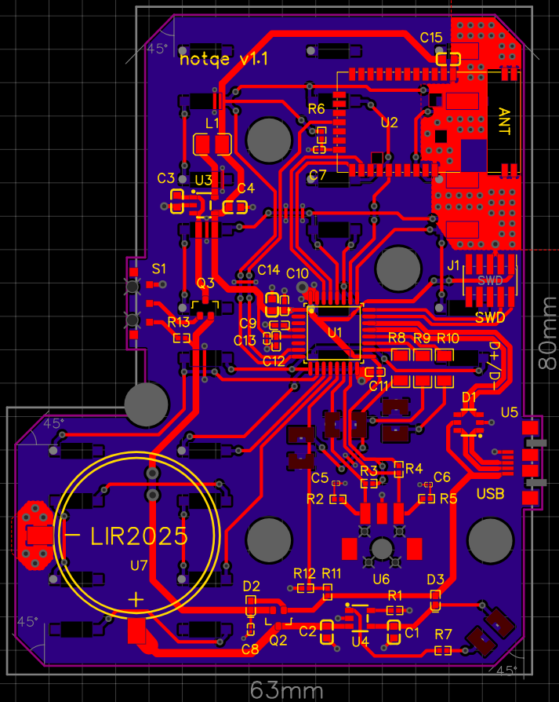
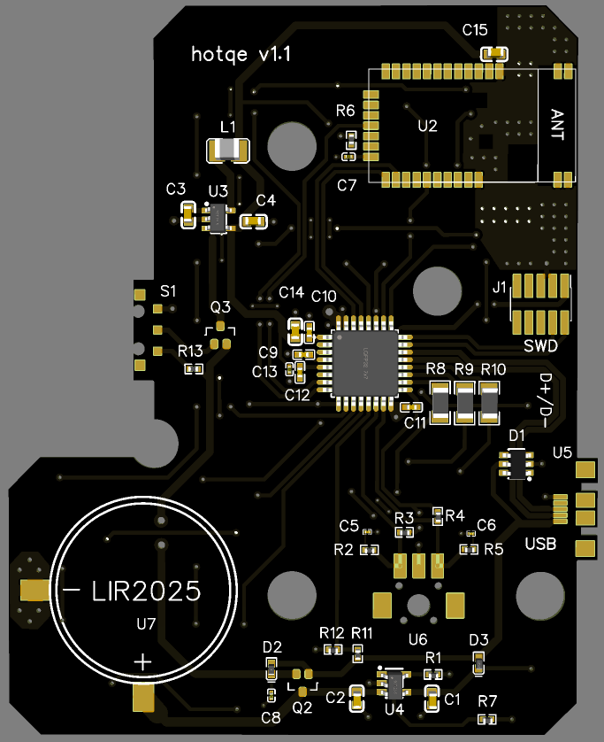
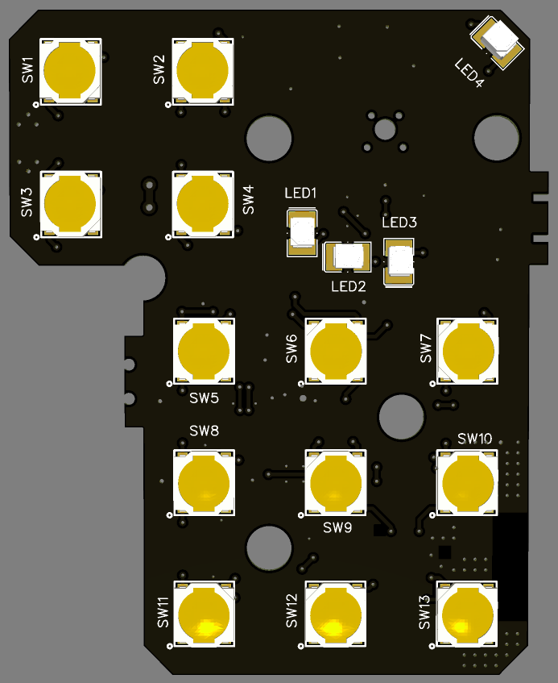
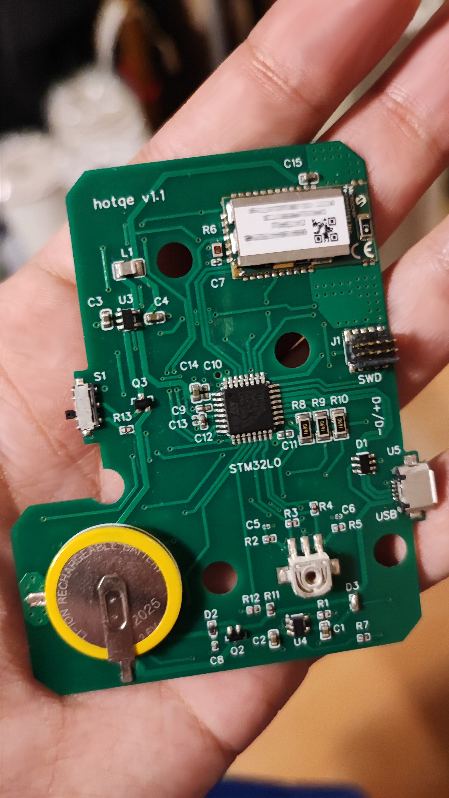
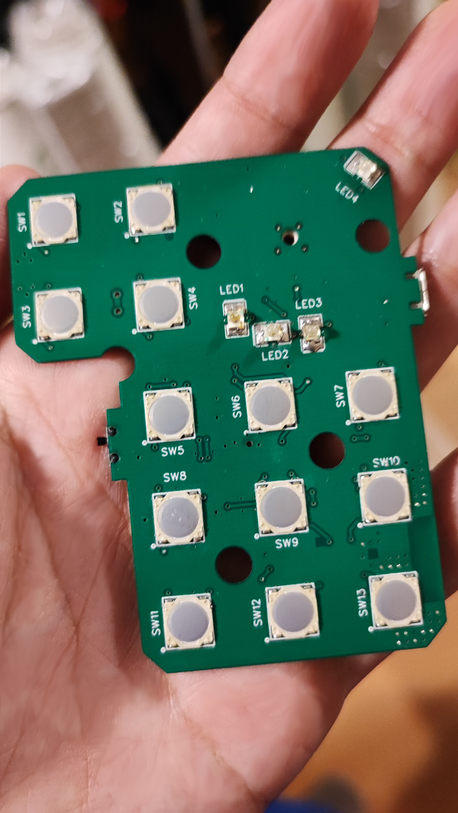

# https://hotqe.com
Hotqe is a custom shortcut and automation remote device. It is thin, compact and convenient, made to improve digital artists workflow as well as regular users remote needs of interaction with custom shortcuts on 9+4 switches and 1 rotary encoder with 3 keypad configurations. Shortcuts and automated actions are programmable with our software over USB.

It runs on low power MCU with ARM Cortex-M0 processor which communicates as HID using bluetooth low energy module as well as USB. It is powered by LIR2025 rechargable battery.

PCB design (2 layers) | PCB 3D top layer | PCB 3D bottom layer
:-------------------------:|:-------------------------:|:-------------------------:
 |  | 

Hand assembled PCB top layer | Hand assembled PCB bottom layer
:-------------------------:|:-------------------------:
 | 

*Product under development, started in 2022.*
